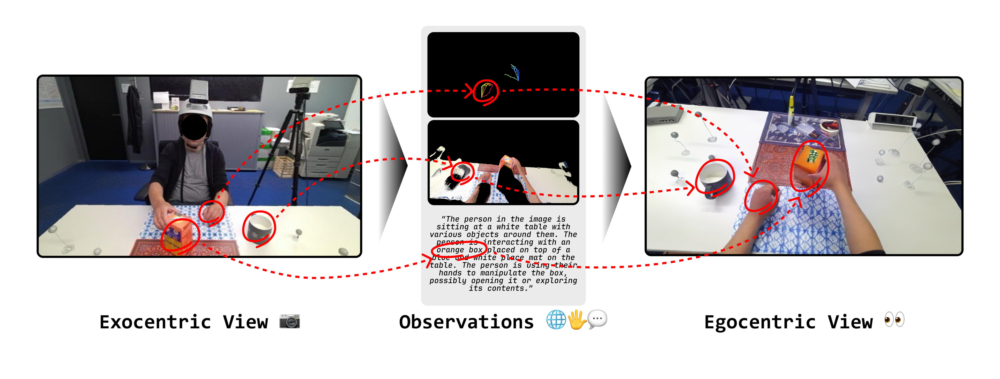

# EgoWorld: Translating Exocentric View to Egocentric View using Rich Exocentric Observations
[](https://arxiv.org/abs/2506.17896)
[](https://redorangeyellowy.github.io/EgoWorld/)

> **EgoWorld: Translating Exocentric View to Egocentric View using Rich Exocentric Observations**
>
> [Junho Park](https://redorangeyellowy.github.io/), [Andrew Sangwoo Ye](https://www.linkedin.com/in/andrew-sangwoo-ye-97a175199/) and [Taein Kwon†](https://taeinkwon.com/)
> 
> († Corresponding author)
>
> - Presented by LG Electronics, KAIST, and University of Oxford
> - Primary contact: [Junho Park](https://redorangeyellowy.github.io/) ( junho18.park@gmail.com ) 

## TL;DR



We introduce **EgoWorld**, a novel two-stage framework that reconstructs an egocentric view from rich exocentric observations, including projected point clouds, 3D hand poses, and textual descriptions. Our approach reconstructs a point cloud from estimated exocentric depth maps, reprojects it into the egocentric perspective, and then applies diffusion-based inpainting to produce dense, semantically coherent egocentric images. Evaluated on the H2O and TACO datasets, EgoWorld achieves state-of-the-art performance and demonstrates robust generalization to new objects, actions, scenes, and subjects. Moreover, EgoWorld shows promising results even on unlabeled real-world examples.

## What's New<a name="news"></a>

[TBD] Code will be comming soon!

[2025/06/22] We release arXiv and project page.

## License and Citation <a name="license-and-citation"></a>

All assets and code are under the [license](./LICENSE) unless specified otherwise.

If this work is helpful for your research, please consider citing the following BibTeX entry.

``` bibtex
@article{park2025egoworld,
  author  = {Park, Junho and Ye, Andrew Sangwoo and Kwon, Taein},
  title   = {EgoWorld: Translating Exocentric View to Egocentric View using Rich Exocentric Observations},
  journal = {arXiv preprint arXiv:2506.17896},
  year    = {2025},
}
```
