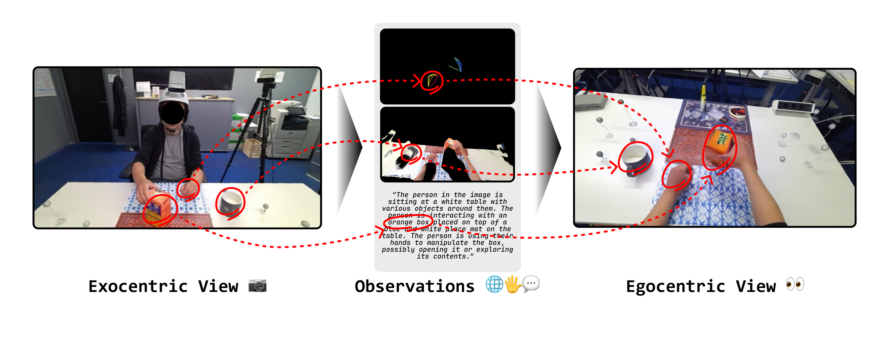

# [ICLR 2026] EgoWorld: Translating Exocentric View to Egocentric View using Rich Exocentric Observations
[](https://arxiv.org/abs/2506.17896)
[](https://redorangeyellowy.github.io/EgoWorld/)
[](https://openreview.net/forum?id=wcTuZG9P2o)

> **EgoWorld: Translating Exocentric View to Egocentric View using Rich Exocentric Observations**
>
> [Junho Park](https://redorangeyellowy.github.io/), [Andrew Sangwoo Ye](https://www.linkedin.com/in/andrew-sangwoo-ye-97a175199/) and [Taein Kwon†](https://taeinkwon.com/)
> 
> († Corresponding author)
>
> - Presented by LG Electronics, KAIST, and University of Oxford
> - Primary contact: [Junho Park](https://redorangeyellowy.github.io/) ( junho18.park@gmail.com ) 

## TL;DR

We introduce ***EgoWorld***, a novel framework that reconstructs an egocentric view from rich exocentric observations, including point clouds, 3D hand poses, and textual descriptions. Our approach reconstructs a point cloud from estimated exocentric depth maps, reprojects it into the egocentric perspective, and then applies diffusion model to produce dense, semantically coherent egocentric images. Evaluated on four datasets (i.e., H2O, TACO, Assembly101, and Ego-Exo4D), *EgoWorld* achieves state-of-the-art performance and demonstrates robust generalization to new objects, actions, scenes, and subjects. Moreover, *EgoWorld* exhibits robustness on in-the-wild examples, underscoring its practical applicability.



## What's New<a name="news"></a>

[2026/05/08] :fire: Our code is released!

[2026/01/26] :brazil: Our paper is accepted by ICLR 2026! Code will be comming soon!

[2025/06/22] :star: We release arXiv and project page.

## Install
```
pip install -r requirements.txt
```

## Train
```
python3 train.py --root_path [ROOT_PATH] --pretrained_path [PRETRAINED_PATH]
```
- [ROOT_PATH] is root path of dataset.
    - [ROOT_PATH] of H2O is `./database/h2o` ([download](https://drive.google.com/file/d/1O-vLPMZV8AbrKS0VObi1o_gpwMN4-rLF/view?usp=sharing)).
- [PRETRAINED_PATH] is pretrained path of model.
    - [PRETRAINED_PATH] of [Stable Diffusion Inpainting](https://huggingface.co/stable-diffusion-v1-5/stable-diffusion-inpainting) is `./checkpoints/sd-v1-5-inpainting.ckpt` ([download](https://drive.google.com/file/d/1i3YLqXUFuXtdkNfQXsx7Z3XPiel3KBUV/view?usp=sharing)).

## Test
```
python3 test.py --root_path [ROOT_PATH] --pretrained_path [PRETRAINED_PATH]
```
- [ROOT_PATH] is root path of dataset.
    - [ROOT_PATH] of H2O is `./database/h2o` ([download](https://drive.google.com/file/d/1O-vLPMZV8AbrKS0VObi1o_gpwMN4-rLF/view?usp=sharing)).
- [PRETRAINED_PATH] is pretrained path of model.
    - [PRETRAINED_PATH] of H2O pretrained model is `./logs/h2o_action/inpainting/lightning_logs/version_0/checkpoints/step=7000.ckpt` ([download](https://drive.google.com/file/d/16P_xt07hGhYIoLAAh6nKPe-KiWPB1hY7/view?usp=sharing)).

## License and Citation <a name="license-and-citation"></a>

All assets and code are under the [license](./LICENSE) unless specified otherwise.

If this work is helpful for your research, please consider citing the following BibTeX entry.

``` bibtex
@inproceedings{park2026egoworld,
  author    = {Park, Junho and Ye, Andrew Sangwoo and Kwon, Taein},
  title     = {EgoWorld: Translating Exocentric View to Egocentric View using Rich Exocentric Observations},
  booktitle = {International Conference on Learning Representations},
  year      = {2026},
}
```
